# PJT-Final: 영화 추천 사이트 만들기

### 1. 팀원 정보 및 업무 분담 내역

고재현 - 영화 정보 (백), 커뮤니티(백, 프론트), 추천 알고리즘

김수민 - 커뮤니티(백), 영화정보(프론트), 추천 알고리즘


### 2. 목표 서비스 구현 및 실제 구현 정도

목표: 크리스마스 컨셉의 3가지 추천 알고리즘에 기반한 영화 추천 사이트 구현

실제 구현 정도: 95%

이유: 커뮤니티의 디테일, 배포의 아쉬움


### 3. 데이터베이스 모델링(ERD)

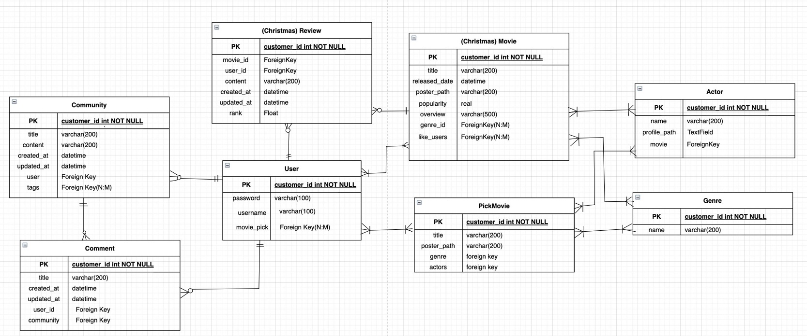


### 4. 필수 기능에 대한 설명

#### 💡 추천 알고리즘 

1) 취향저격 영화추천 - 협업 필터링 기반 추천

>  협업 필터링이란? 

많은 유저들로부터 모은 취향 정보들을 기반으로 하여 스스로 예측하는 기술

> 사용자 기반 추천(User-based Recommendation)

나와 비슷한 성향을 지닌 사용자를 기반으로, 그 사람이 구매한 상품을 추천하는 방식

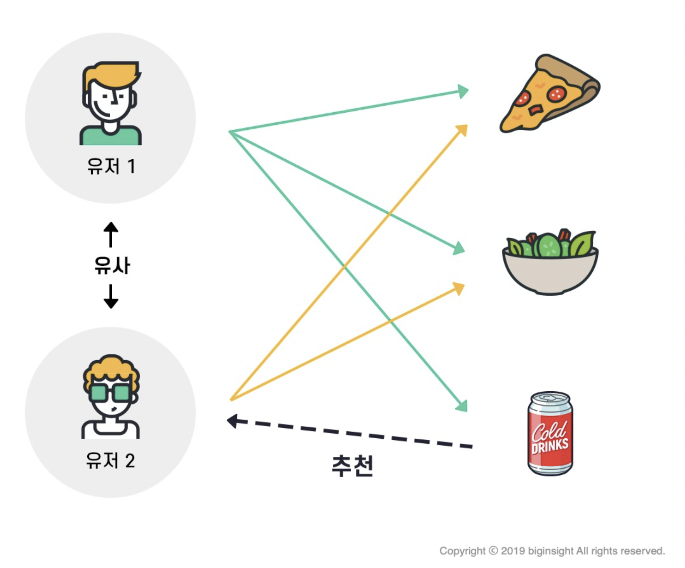

1. 사용자의 취향 파악 

   - 회원가입 시, 장르 별 대표적인 영화 20개 중, 5개 선택
   - 5개 영화의 장르들 중에서, 가장 많이 나온 장르 2개 유저 정보에 저장

   ```python
   @api_view(['POST'])
   def save_user_genre(request):
       genre_dict = defaultdict(int)
       user = get_object_or_404(User, pk=request.user.id)
       for movie in user.moviepicks.all():
           for genre in movie.genre_ids.all():
               genre_dict[genre.name] += 1
       sorted_genre_dict = sorted(genre_dict.items(), reverse=True, key=lambda item:item[1])
       print(sorted_genre_dict)
       user.first_genre = sorted_genre_dict[0][0]
       user.second_genre = sorted_genre_dict[1][0]
       user.save()
       return Response()
   ```

   

2. 유사한 유저 찾기 & 사용자 기반 추천

   - 나를 제외한 유저들 중, 좋아하는 2개의 장르가 모두 같은 경우
     - 그 유저들 이 좋아요를 누른 영화들을 나의 추천 영화 목록에 추가  
   - 하나의 장르만 같은 경우도
     - 그 유저들이 좋아요를 누른 영화들을 나의 추천 영화 목록에 추가

   ```python
   @api_view(['GET'])
   def get_recommend_movie(request):
       recommend_movie_list = []
       user = get_object_or_404(User, pk=request.user.id)
       users = User.objects.all()
       for check_user in users:
           if check_user == user: 
               continue
           # 1, 2순위 장르가 겹치면
           if (check_user.first_genre == user.first_genre and check_user.second_genre == user.second_genre) or (check_user.first_genre == user.second_genre and check_user.second_genre == user.first_genre):
               recommend_movie = check_user.like_movies.all()
               # 그 유저가 좋아요 누른 영화들 추천리스트에 추가
               for r_movie in recommend_movie:
                   recommend_movie_list.append(r_movie)
           # 하나만 겹칠 경우에도 그 다음 순으로 추가
           elif (check_user.first_genre == user.first_genre or check_user.second_genre == user.second_genre) or (check_user.first_genre == user.second_genre or check_user.second_genre == user.first_genre):
               recommend_movie = check_user.like_movies.all()
               for r_movie in recommend_movie:
                   recommend_movie_list.append(r_movie)
           serializer = MovieSerializer(set(recommend_movie_list), many=True)
       return Response(serializer.data)
   ```

   


2) 크리스마스 영화추천

1. 크리스마스를 키워드로 갖는 영화 데이터를 따로 저장
2. 크리스마스 영화를 랜덤순으로 추천

```python
@api_view(['GET', 'POST'])
def christmasmovie_list(request):
    if request.method == "GET":
        # 랜덤순으로 정렬
        christmasmovies = ChristmasMovie.objects.order_by('?')
        serializers = ChristmasMovieListSerializer(christmasmovies, many=True)
        return Response(serializers.data)

    elif request.method == 'POST':
        serializer = ChristmasMovieSerializer(data=request.data)
        if serializer.is_valid(raise_exception=True):
            serializer.save()
            return Response(serializer.data, status=status.HTTP_201_CREATED)
```


3) 박스 오피스 기반 추천

1. popular한 영화 100개 저장
2. 사용자들의 좋아요 개수 많은 순으로 추천

```python
@api_view(['GET', 'POST'])
def movie_list(request):
    if request.method == "GET":
      # 좋아요 순으로 정렬
        movies = Movie.objects.annotate(likes=Count('like_users')).all().order_by('-likes')
        serializers = MovieListSerializer(movies, many=True)
        return Response(serializers.data)

    elif request.method == 'POST':
        serializer = MovieSerializer(data=request.data)
        if serializer.is_valid(raise_exception=True):
            serializer.save()
            return Response(serializer.data, status=status.HTTP_201_CREATED)
```


#### 💡 데이터 수집

- 웹 사이트 개발을 위한 데이터 수집을 가장 먼저 진행했으며, 여러 TMDB API를 활용하여 주요 데이터를 수집하였다. 

**API로 받아온 데이터를 DB로 저장하기**

1. 데이터를 저장할 DB의 모델을 작성한다

   ```python
   class Movie(models.Model):
   
       title = models.CharField(max_length=50)
       popularity = models.FloatField()
       genre_ids = models.ManyToManyField(Genre, related_name='movie_genre')
       release_date = models.DateField()
       overview = models.TextField()
       poster_path = models.TextField()
   ```

2. 영화 정보를 페이지별로 가져와서 for문을 돌려 새로운 json 파일에 저장한다

   ```python
   import json
   import requests
   result = []
   url = 'https://api.themoviedb.org/3/movie/popular'
   key = 'f9acc36e1794da31c1fa05368571a14c'
   for page in range(1, 6):
       URL = f'{url}?api_key={key}&language=ko-Kr&page={page}'
   
       raw_data = requests.get(URL).json()
       data = raw_data.get('results')
       for movie in data:
           movie_dict = {
               "model" : "movies.movie",
               "pk" : movie.get("id"),
               "fields" : {
                   "title" : movie.get("title"),
                   "popularity" : movie.get("popularity"),
                   "genre_ids" : movie.get("genre_ids"),
                   "release_date" : movie.get("release_date"),
                   "overview" : movie.get("overview"),
                   "poster_path" : movie.get("poster_path")
               }
           }
           result.append(movie_dict)
   
   with open('movies.json', 'w', encoding='UTF-8') as file:
       file.write(json.dumps(result, ensure_ascii=False))
   ```

   3. json 파일에 저장된 데이터를 아래의 `loaddata` 명령을 통해 DB를 가져온다. 이때, Movie 모델이 Genre 모델을 참조하고 있으므로 loaddata 명령은 반드시 Genre -> Movie 순으로 시행한다. 

      ```
      $ python manage.py loaddata movies/get_movie_data/movies.json
      ```

	사용한 API는 Get Popular, Get Credits, Get Keyword, Get Video가 있다. 

#### 💡영화 정보

1. 영화 메인 페이지
   - 메인 페이지에서는 3가지의 추천 알고리즘이 한 눈에 보일 수 있도록 총 3줄로 구현하였다.
   - Card, Carousel을 활용하여 영화의 포스터를 나열하였고 페이지를 넘길 때마다 초록과 빨강이 번갈아 나오도록 하였다.
   -  각 영화 포스터에 마우스를 올리면 카드가 어두워지면서 영화 제목, 영화 간략 설명, 장르가 나오고 좋아요 버튼과 좋아요 수가 보여진다. 
   - 이때 좋아요(하트) 버튼을 누르면 좋아요 수가 하나 증가하면서 하트가 빨간색으로 변한다. 
2. 영화 상세 페이지
   - 영화의 상세 페이지에는 영화 제목, 영화 상세 설명, 장르, 개봉일자가 표시된다. 
   - 이때 재생 버튼을 누르면 youtube에서 해당 영화와 관련된 영상이 재생된다. 
   - 화면 왼쪽에는 내용과 평점을 담은 한줄평을 작성할 수 있고 삭제는 작성자만이 가능하다. 


#### 💡 커뮤니티 기능

- 커뮤니티에서는 제목, 내용, 태그를 활용한 글을 작성할 수 있는데 이때 태그는 인스타그램처럼 앞에 #을 붙여서 쓴다. 

- 쓰여진 태그는 검색 기능에 이용되며 같은 태그를 쓴 글이 검색된다.

-  커뮤니티의 글은 수정 삭제가 가능하며 글 작성자만이 수정 삭제가 가능하다. 

  ```python
  taglist = []
  taglist = request.data['tags'].split('#')[1:]
         
          
  serializer = CommunitySerializer(data=request.data)
  if serializer.is_valid(raise_exception=True):
      serializer.save(user=request.user)
      print(serializer.data)
      community= get_object_or_404(Community, pk =serializer.data['id'])
  
      for i in range(len(taglist)):
          print(type(taglist[i]))
          if not Tag.objects.filter(name=taglist[i]).exists():
              Tag.objects.create(name=taglist[i])
          tag = Tag.objects.get(name=taglist[i])
          print(tag)
          community.tags.add(tag)
     return Response(serializer.data, status=status.HTTP_201_CREATED)
  ```

### 5. 배포 서버 URL


### 6. 기타 느낀 점

[수민]

1주일만에 이런 결과물이 나올 수 있는게 너무 신기하고 뿌듯했다. 돌이켜보면 힘든 때도 있었지만 페어와 즐겁게 함께하니 웃음으로 극복할 수 있었던 것 같다. 면접이 일정이 겹치는 바람에 저녁이후 시간대에 시간을 쏟지 못해 재현이가 훨씬 고생한 것 같아 아쉽고 미안했다. 결과적으로 프로젝트 최우수상도 받고 전체적으로 1학기를 복습도 하면서 너무 뿌듯한 프로젝트였다~! 

### 7. 결과사진


**Home화면** - 크리스마스 추천 영화, 취향저격 추천 영화, 박스오피스 추천 영화 

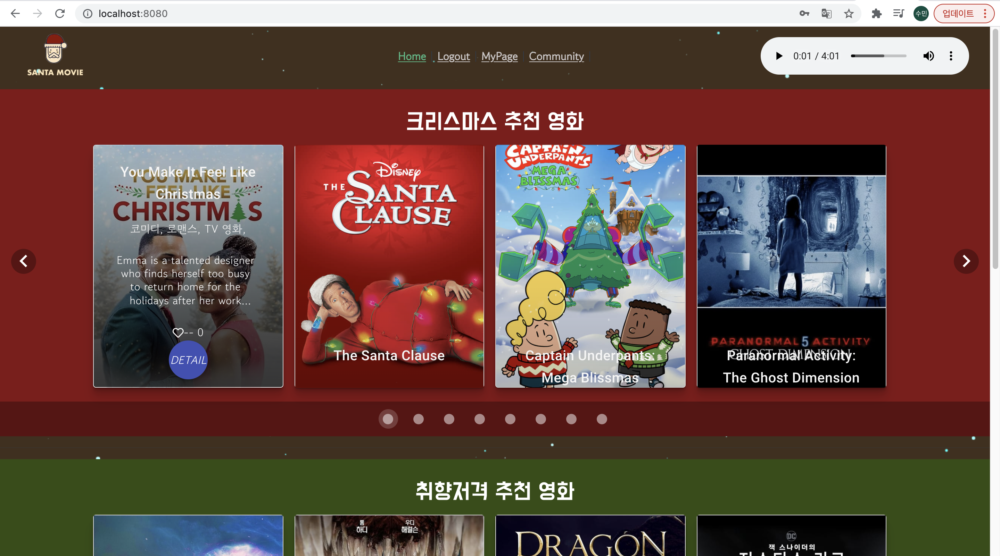


**영화 상세 페이지**

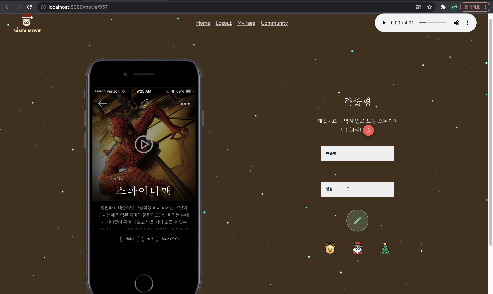


**영화 상세 페이지 - 줄거리 더보기**

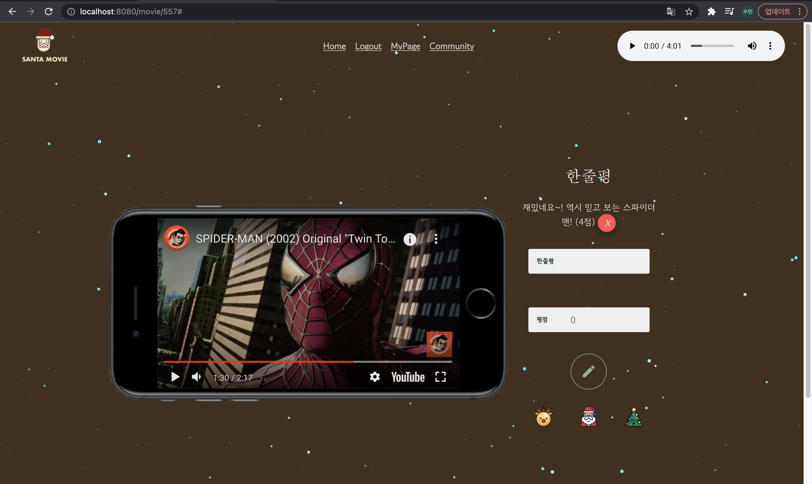


**영화 상세 페이지 - 예고편 보기**


**커뮤니티 페이지**

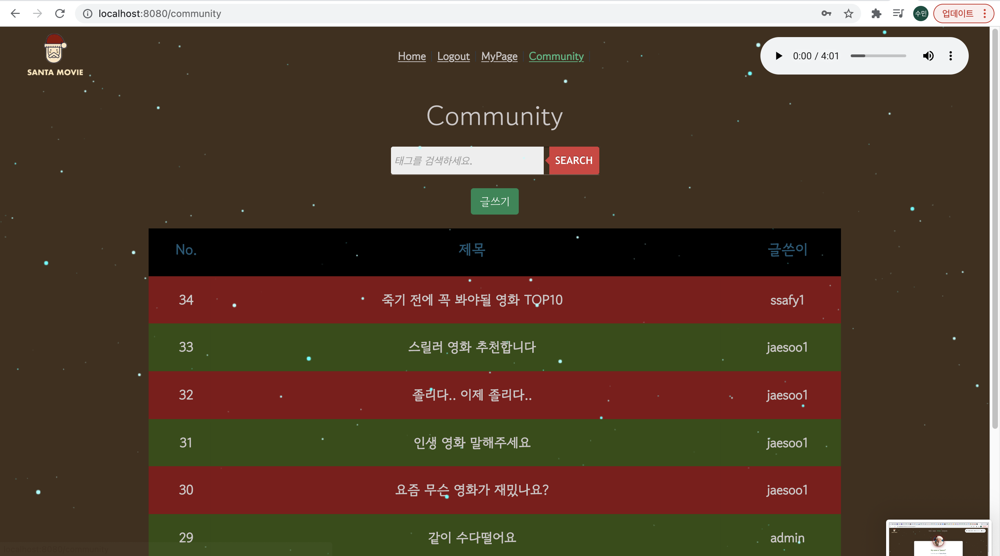


**커뮤니티 페이지 - 태그로 검색**

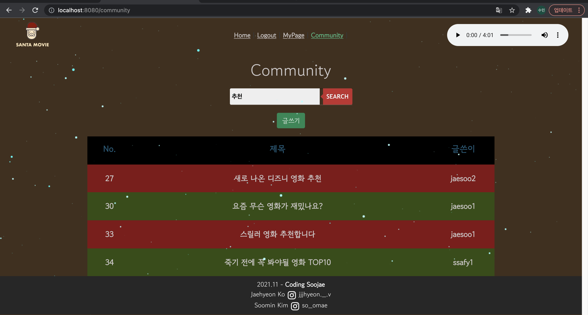


**커뮤니티 페이지 - 글 작성**

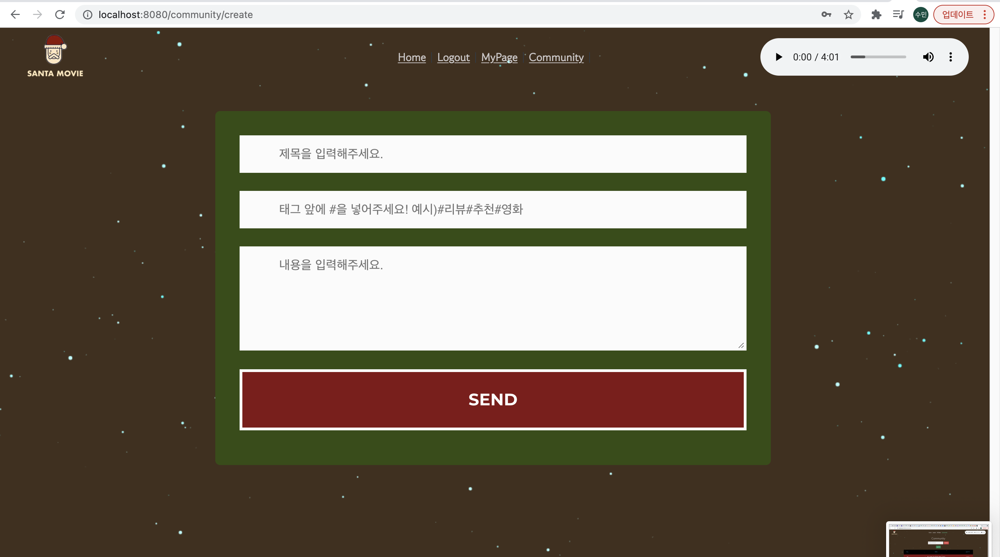


**커뮤니티 페이지 - 게시글 상세보기**

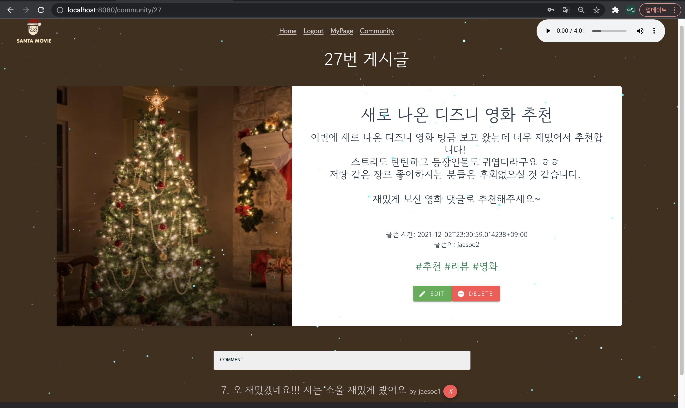


**마이 페이지**

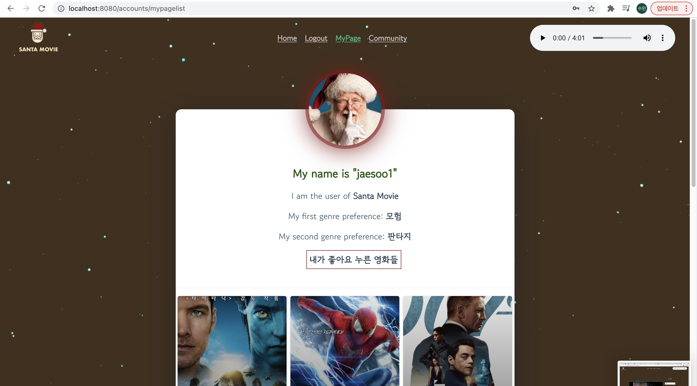


**회원가입**

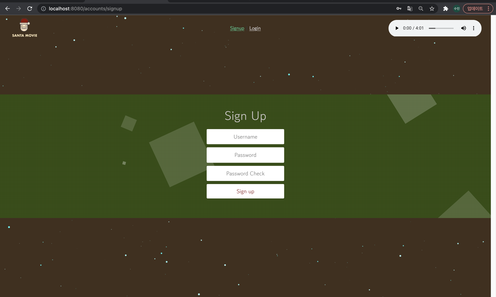


**회원가입 - 영화 취향 고르기**


**로그인**

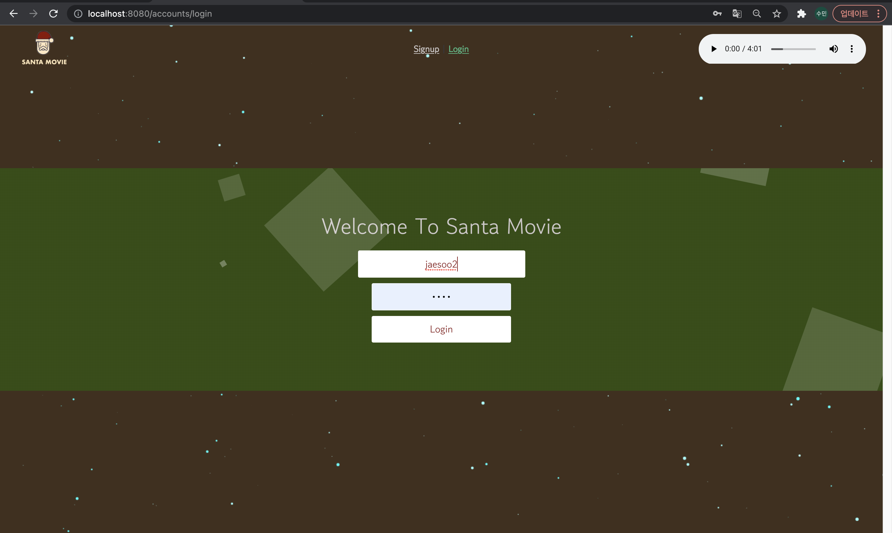


### 8. 회의과정


>  ## 11/17(수)

### 🌈Goals

- 팀원 간 아이스브레이킹
- 우선순위 설정
- DB 모델링 - ERD 다이어그램
- Django 서버 구축

### 🌈Discussion Items

- 팀명 - 코딩수재(수민 + 재현)

- 컨셉

  - 크리스마스
  - 간지나되, 깔끔하게
  - 로고, 사이트 네이밍

- 기능

  1. 기본 기능 - 기본은 완벽하게!

     

  💡 데이터 수집(API) - **TMDB API**

  💡 관리자 뷰(영화 등록, 수정, 삭제) + 유저 관리 권한

  💡 영화 정보

  - 평점(별점, 한줄평) 등록, 수정, 삭제

  - 메인페이지 - 추천된 영화 목록(간지나게)

  - 상세정보(포스터, 장르, 줄거리, 평점, 예고편)

    

  2. 추천 알고리즘 - 어떻게 하면 취향저격 영화를 추천할 수 있을까!

   ### 🤯브레인스토밍

  재현이의 영화 선택 기준 ) 장르가 젤 중요(애니메이션), 유명한, 어두운 vs 밝은

  수민이의 영화 선택 기준) 외국영화 선호, 장르, 유명한거, 숨겨진 명작

  **협업 필터링 - 비슷한 취향의 유저가 추천한 영화를 추천 - 좋아요 기능**

  비슷한 취향: 회원가입 시 여러개 영화 중 몇개 선택 -> 장르, 배우 등으로 취향 분류

  Collaboraiton Filtering

  → Explict DataSet Neighborhood model

  https://yeomko.tistory.com/6?category=805638

  감독, **장르, 배우,** 내용 등에서 유사한 콘텐츠 추천

  시기별 추천(크리스마스, 여름, 겨울)

  타임머신 → 몇 년전으로 돌아갈까? 그 시기에 맞는 영화 추천

  재밌는 설문을 통한 추천

  검색, 좋아요로 초기 선호 데이터 업데이트

  비슷한 영화추천 →

  Hybrid Filtering(협업 + 콘텐츠 기반)

  - 회원가입 할 때, 좋아하는 영화 픽 & 장르 → 취향 반영

  - 여행가고싶은 나라 - 그 나라 영화 추천

  - 좋아하는 배우 선택 → 비슷한 느낌의 배우 추천, 그 배우의 필모그라피 추천

  - 기분

    

  ### 🎄확정

  컨셉 - 크리스마스

  [박스오피스 기준 TOP 영화들]

  [크리스마스 영화들]

  [추천 영화들]

  회원가입 → 장르&종류별 대표 영화 여러개 선택 → 유저 취향 저장 → 가장 베스트인 장르 기반 추천

  협업 필터링 → 같은 취향의 유저가 좋아요 누른 영화들을 좋아요 순으로 출력

  타임머신 → 해당 연도의 영화 랜덤으로 출력

  영화 상세 정보

  포스터, 장르, 주연배우, 평점, 영화 description, 예고편

  포스터 + 마우스 오버시: 플립되면서 제목, 짧은 줄거리, 평점, 장르 나오고

  클릭하면 줄거리, 한줄평 리뷰, 주연 배우, 예고편

  **프론트엔드**

  주요 컬러 - 빨간색, 진초록

  bgm - 캐롤

  💡 커뮤니티

  - 글 (자유 글)조회, 생성, 삭제

  - 댓글 작성, 삭제(생성 및 수정 시각 포함)

  - 글 작성할때 태그 선택 + 추가 작성

  - 해시태그로 검색 가능하게(시간 되면 2개 이상)

    

  💡 추가기능

  - 소셜로그인, 비밀번호 & 아이디 찾기

  - 페이지네이션

- Youtube API -  영화 예고편

  ### 🌈계획


점심은 든든하게


> ## **11/18(목)**

### 🌈Goals

- Git 레포지토리 만들기 ✔︎
- Django 서버 구축 ✔︎
- Model 작성, Account, Community, Movies 기능 개발 (Model 작성 + Account 기능 개발까지)
- API를 JSON 파일로 불러와 DB에 저장 ✔︎

### 🌈Discussion Items

✅ 재현이의 목표

- tmdb에서 Json파일 받아와서 DB에 저장 ✔︎

- Home 페이지에 server, client 완료 ✔︎

- 영화상세정보는 api ✔︎

- 별점 Modeling ✔︎

✅ 해야할 것

- 영화 상세 페이지 vue에 한줄평 쓸수 있도록

- 배우 정보 추가

- 별점 CRUD

- 좋아요 기능

✅ 수민이의 목표

- 회원가입, 로그인 구현 ✔︎

- 커뮤니티, 유저 정보 모델링 ✔︎

- 회원가입 후 myPage에 장르별 대표영화 고를 수 있는 기능 ✔︎

✅ 해야할 것

- 대표 영화 고르면 유저 db에 저장

- 커뮤니티 CRUD, vue

- 영화추천 알고리즘 시작...........


점심은 든든하게


> ## 11월 22일(월)

월요일 아자아자 화이팅.

# Goals

- Community, 댓글 Vue

- 커뮤니티-유저, 커뮤니티-태그

- My Page Vue, 유저에 선호하는 영화 데이터 저장

- 영화 추천 알고리즘

- 장르연결

  

# Discussion Items

- 

# Action Items


- [x] PickMovie - Genre 연결 

- [x] My Page Vue, 유저에 선호하는 영화 데이터 저장 

- [x] Community, 댓글 Vue 

- [x] 커뮤니티-유저 연결 

- [x] 합치기

- [x] 커뮤니티-태그 

- [x] 태그 검색 

  


> 상대경로시 에러

"attempted relative import beyond top-level package" 에러

```python
import os
from movies.models import Genre
```

..movies 이런식으로 상대 경로를 설정하는 것은 디버깅 설정에 따라 다를 수 있다.

따라서 패키지 이름을 넣어 선언하면 다른 앱에 있는 함수나 모델들 불러올 수 있음.


> ManyToMany Field Serializer 데이터 저장

Create하면서 동시에 ManyToMany 데이터 추가해야되는데, 막막했음. 

Django 공식 문서를 보며 해결.

1. 먼저 serializer.save()를 통해 community 생성
2. 생성한 serializer의 id로 community object 얻어오기
3. 태그 리스트 반복문 돌면서 해당하는 이름의 태그 Object 불러오기
4. 없으면 Tag 테이블에 추가
5. 해당 Tag Object를 Community Object의 ManyToMany Field에 추가

```python
		taglist = request.data['tags'].split('#')[1:]  
    serializer = CommunitySerializer(data=request.data)
    if serializer.is_valid(raise_exception=True):
        serializer.save(user=request.user)
        community= get_object_or_404(Community, pk =serializer.data['id'])

        for i in range(len(taglist)):
            if not Tag.objects.filter(name=taglist[i]).exists():
                Tag.objects.create(name=taglist[i])
            tag = Tag.objects.get(name=taglist[i])
            community.tags.add(tag)
            return Response(serializer.data, status=status.HTTP_201_CREATED)
```


### 중간 결과 사진 - 꾸미기 전!!!

1. Home 화면 - 영화 추천할

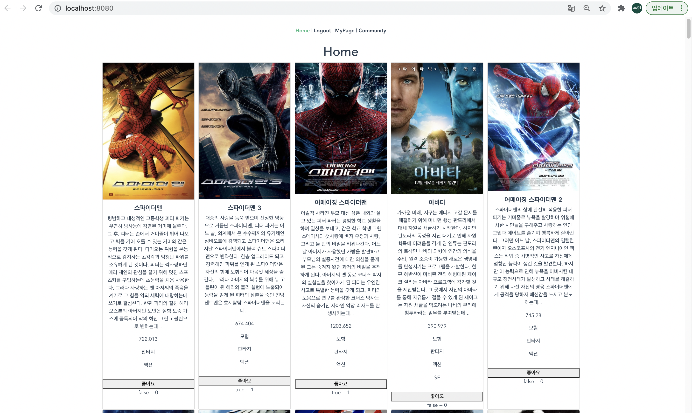

2. 커뮤니티 화면

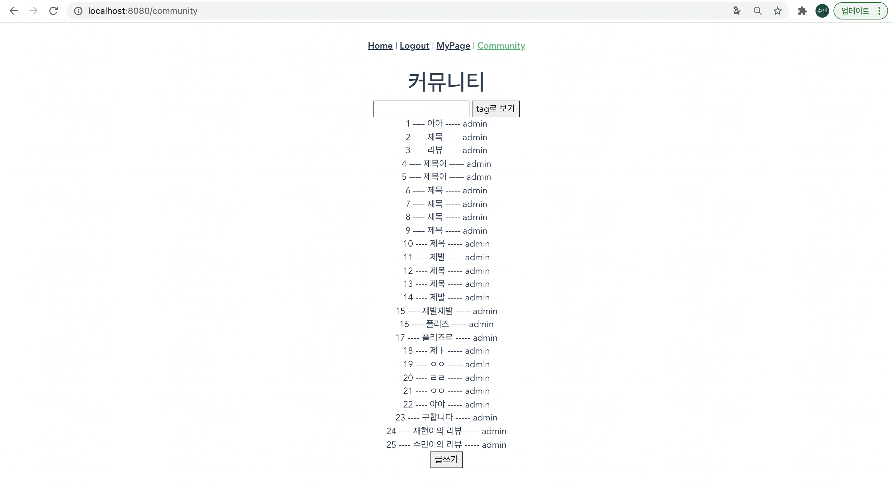

3. 커뮤니티 - 태그로 검색

   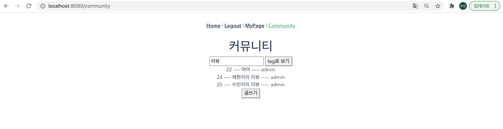

   4. 회원가입 - 영화취향 고르기

      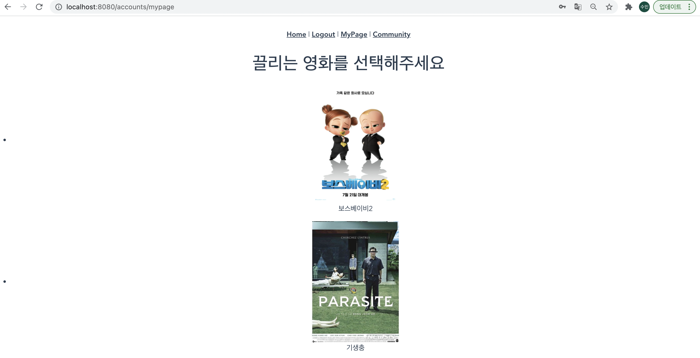

   5. 마이페이지

   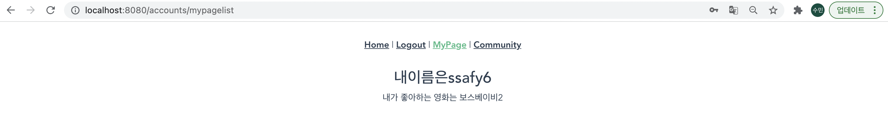


오늘은 재현이가 아팠다. 아픈데도 프로젝트를 중단할 수 없는 현실이 참 슬펐다.

수민이는 가슴이 답답하다. 오늘 눈이 온다는 소식이 들린다. 마음이 싱숭생숭하다. 

그래도 스트레스뿐이었던 어제 밤보단 낫다. 어제 밤에는 각자 했기 때문이다.

역시 페어를 만나야 힘이 나는 것 같다. 내일도 화이팅.


> ## 11월 23일(화)

## Goals

- [ ] 영화 추천 알고리즘
- [ ] 데이터 넣어야 될 것: MoviePick, Christmas 영화
- [ ] 꾸미는 거 시작
- [ ] 협업 필터링 


🌟 협업 Filtering

1. 회원가입 시 좋아하는 영화 여러개 선택 - 가장 많은 장르 1, 2순위

- 여러개 어려우면 하나만 선택해서 장르 두개 뽑기

2. 유저가 선택한 좋아하는 영화 장르를 똑같이 좋아하는 유저 뽑기

3. 그 유저가 좋아요 누른 영화들을 좋아요 많은 순으로 추천

   

🎄 크리스마스

1. 좋아하는 장르 먼저 보여주기

2. 데이터는 직접 넣기

   

💡 영화 유명한 순으로


# Action Items

- [x] 협업 필터링
- [x] 좋아요 Vue 수정
- [x] 유튜브 예고편 넣기
- [x] 크리스마스 데이터 불러와서 db 저장
- [x] home 화면 꾸미기


- **협업 필터링 추천 알고리즘**
  - 사용자가 회원가입시 대표 영화 20개 중 좋아하는 영화 5개를 고르면 save_movie 함수를 통해 user의 pickmovie에 저장한다. 
  - 저장된 pickmovies의 장르를 합쳐서 그 중 TOP 2개의 장르를 save_user_genre 함수흫 통해 user의 최애 장르(user 모델의 first_genre와 second genre필드)로 저장한다.
  - 사용자의 1순위, 2순위 장르를 공통적으로 가지고 있는 다른 유저들을 찾고 그 유저들이 좋아요 누른 영화들을 get_recommend_movie를 통해 가져온다.  
  - 여기서 해결해야할 점은 가져온 영화들을 좋아요 순으로 나열해야한다는 점이다

```python
@api_view(['POST'])
def save_movie(request, movie_id):
    mymovie = get_object_or_404(PickMovie, pk=movie_id)
    user = get_object_or_404(User, pk=request.user.id)
    user.moviepicks.add(mymovie)
    user.save()
    print(user.moviepicks)
    return Response()


@api_view(['POST'])
def save_user_genre(request):
    genre_dict = defaultdict(int)
    user = get_object_or_404(User, pk=request.user.id)
    for movie in user.moviepicks.all():
        for genre in movie.genre_ids.all():
            genre_dict[genre.name] += 1
    sorted_genre_dict = sorted(genre_dict.items(), reverse=True, key=lambda item:item[1])
    print(sorted_genre_dict)
    user.first_genre = sorted_genre_dict[0][0]
    user.second_genre = sorted_genre_dict[1][0]
    user.save()
    return Response()


@api_view(['GET'])
def get_recommend_movie(request):
    recommend_movie_list = []
    user = get_object_or_404(User, pk=request.user.id)
    print(user.username)
    users = User.objects.all()
    for check_user in users:
        if check_user == user: 
            continue
        if (check_user.first_genre == user.first_genre and check_user.second_genre == user.second_genre) or (check_user.first_genre == user.second_genre and check_user.second_genre == user.first_genre):
            recommend_movie = check_user.like_movies.all()
            for r_movie in recommend_movie:
                recommend_movie_list.append(r_movie)
    serializer = MovieSerializer(set(recommend_movie_list), many=True)
    return Response(serializer.data)

```


- **유튜브 예고편 넣기**

  - 먼저 tmdb에서 movie.id를 통해 video를 가져오는 API를 사용했다.
  - 이때 API에는 유튜브 API에 필요한 key 값이 오기 때문에 그 키 값을 가지고 유튜브 API에 접근하였다.
  - 동영상은 <iframe>을 사용해 html에 띄워주었다.

  ```javascript
  getpreview: function() {
        console.log(this.movie.id)
        axios({
          method: "GET",
          url: `https://api.themoviedb.org/3/movie/${this.$route.params.movieId}/videos?api_key=API_KEY&language=en-US`,
          headers: this.setToken()
  
        })
        .then(res => {
          if (res.data.results) {
            this.video_key = res.data.results[0].key
            this.videoUrl = `https://www.youtube.com/embed/${this.video_key}`
          }
  
        })
      },
  ```

  

#### 중간 결과 사진

- 협엽 필터링 기반 영화 추천

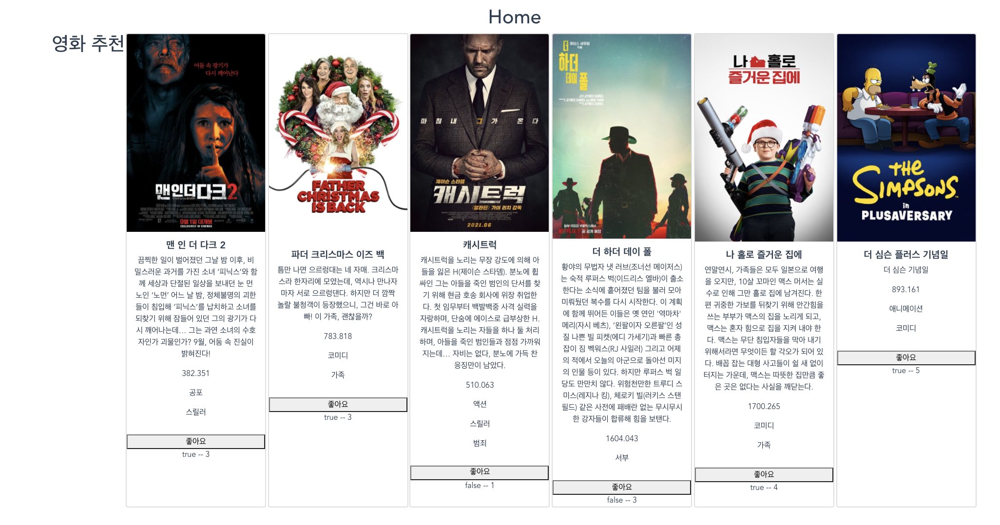

- 영화 상세 페이지에 유튜브 예고편 삽입

  

#### 느낀 점

기본 기능이 어느정도 가춰졌다.. 그치만 꾸미는게 너무 걱정이다,, 그러나 해낼 수 있다!!!!!!

내일은 조금 더 화이팅~~


### 새롭게 알게된 부분

>  텍스트가 긴 경우 ...기호 넣는 법

```css
text-overflow: ellipsis;
```

세가지 조건 필요

i. width 또는 height가 고정적일 것
ii. overflow: hidden; 을 사용해 영역을 감출 것
iii. 아래줄로 내려가는 것을 막기위해 white-space: nowrap 등이 필요

+display 속성이 블럭 형태인 경우에만 적용 됨

```css
body span {
  display: block;  // inline-block으로 설정 필요
}
```

적용예시

```css
div p {
 overflow: hidden;
 text-overflow: ellipsis;
 white-space: nowrap;
 width: 100px;
 height: 20px;
}
```


> 이미지 사이즈 맞추기

```css
.image {
  background-image: url("./images/nana.jpg");
  background-size: cover; /* 비율 맞춰서 넣으려면 contain */
  background-repeat: no-repeat; /* div보다 이미지 사이즈 작으면 이미지 반복되는거 방지*/
  background-position: center; /* 가운데 정렬 */
}
```

서버에서 이미지 주소 전달하는 경우

```html
<div style="background-image: url('./images/nana.gif')"></div>
```

| **contain**                                     | 이미지의 가로세로 비율을 유지하면서, 이미지가 잘리지 않을 때까지만 채웁니다. |
| ----------------------------------------------- | ------------------------------------------------------------ |
| **cover**                                       | 이미지의 가로세로 비율을 유지하면서, 이미지가 잘리더라도 주어진 크기를 꽉 채웁니다. |
| **사이즈 직접 입력** **(100%, 200px, 50em 등)** | 비율에 무관하게 입력한 값에 맞춰 사이즈를 조절합니다. 하나만 입력하면 가로값만, 쉼표 없이 두 개를 입력하면 가로값과 세로값을 동시에 설정합니다. |


> 오디오 삽입

```html
<audio autoplay controls loop>
      <source src="@/audio/song_name.mp3" type="audio/mpeg"> default
    </audio>
```

autoplay: 자동 재생

- - 예제: <audio autoplay>

controls: 음악 플레이어 UI 화면에 표시

- - 예제: <audio controls >

loop: 무한 반복

- - 예제: <audio loop > 


> vuetify에서 v-img에 :to로 링크 걸기


```html
<router-link to="/">
        <v-img src="@/assets/SantaMovieLogo.png" :to="{name: 'Home' }" style="display: inline-block; float:left; margin-top:-40px;width: 100px; height: 100px; vertical-align: middle; " >
        </v-img>
</router-link>
```


> vuejs에서 태그 및 컴포넌트 요소에 backgroundImage 인라인 스타일을 사용하여 백그라운드 이미지 추가

```html
<div class="sidebar__bg"
        v-bind:style="{ backgroundImage: 'url(' + this.imgUrl + ')' }"></div>
```


> float:left 대체

display: inline, inline-block

float:left가 들어간 선택자는 text-align: center가 적용되지 않음.

-> 상위 선택자에 text-align:center을 넣고, 하위 선택자 중, 좌측 정렬 되어야 할 선택자에 display:inline 적용

우측 정렬 되어야 할 선택자에 display: inline-block 적용


> vueJs에 JavaScript 직접 사용하고 싶을 때

mounted: function() {

 여기다가 넣으면 된다.

}


> jquery 쓰기

```bash
npm install jquery
```

```js
import $ from 'jquery'
```


> v-for과 객체


```html
<div v-for="(value, name, idx) in object">
  {{idx}}. {{name}}: {{value}}
</div>
```


